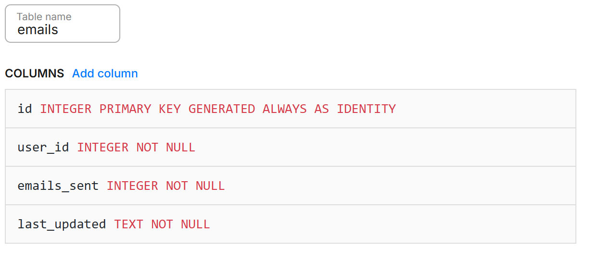
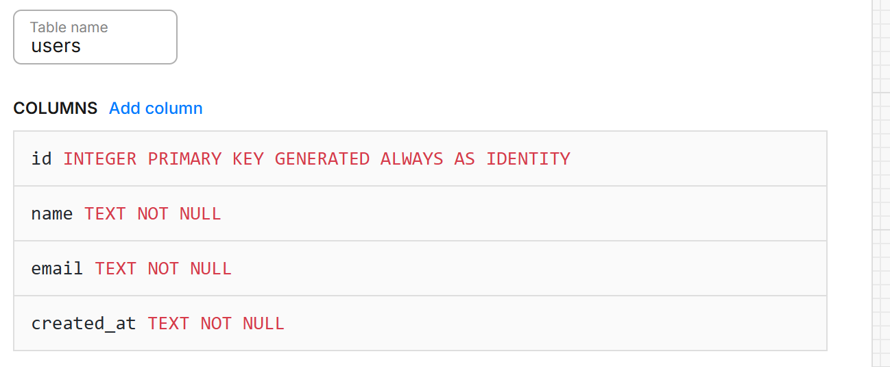

# ANNOY-FRIEND

View project [here](https://youtu.be/_dqD4BFWDmA)
or a project [here](https://annoy-friend.onrender.com/)(you can't sign in though)
## What is this?
This is a project that utilizes Node.js to help users annoy their friends by sending automated emails that convey whatever the user wants to say to their friend. Note that there should be a part where the user must input their email so that this API can send emails from this. 

## How does this work?
Annoy-Friend is a platform where users send AI-enhanced emails. There is a feature that allows users like you to create emails using Google Gemini through a prompt. 

## How to set up
See website [here](https://annoy-friend.onrender.com/)! Then go to the "My Emails" tab and add a new one.
*Note: As using I am using GMAIL API, and this has to go through verification(which I cannot pass as I do not have a valid domain name), you cannot sign up. 

## APIs used
GMAIL API, GEMINI API

## How do I run this myself?
1. Download this repository
2. Rename .env.sample to .env
3. Create a Google project with scopes ["http://localhost:3000/login", "http://localhost:3000/oauth2callback/signup"], and download the client ID/secret, renaming it oauth2.keys.json and putting it in the main folder. Add the client ID to the .env file. Make sure to add users to your audience
4. Go to Neon.tech and create an account. Make a DB where you have tables like the following: 

Take the .env url and add it to the .env.sample. 
5. Go to https://aistudio.google.com/ and get an API key. add it to the .env sample
6. Rename the main_urls in the .env and oauth2.keys.json to whatever your project website is called. If left at default, use 'http://localhost:3000'
7. Make sure the oauth2.keys.json is in the same format as the oauth2.keys.ex.json file. If so, delete oauth2.keys.ex.json
8. Click Ctrl+` and run npm init
9. Run "npm start" in PowerShell
10. Open "http://localhost:3000" or your main url in a browser
11. Hopefully it works!!

## Was this AI-generated?
I used a small amount of AI to help me optimize the backend of Annoy-Friend. The styles.css, login/signup/tos/404/505/main/about.html page was almost exclusively written in AI, as I am not talented at creating websites. However, the prompt seen in ./txt/prompt.txt was written by me. The phrase "**playfully** create tension" was edited by AI to be "more friendly", which was previously written as "create tension." ChatGPT also helped me create the content.ex.txt example. The output.txt was an example of a Google Gemini Flash 2.0 output. The "AI write" feature will use AI to generate an ~~ insulting ~ ~playful, and ~~cringey~~funny message. The README went through Grammarly for grammatical errors